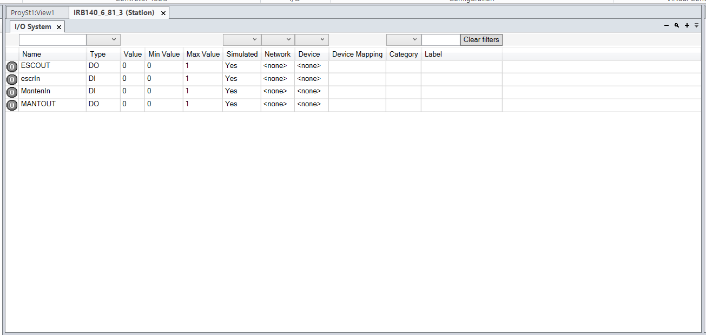
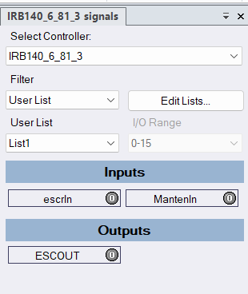
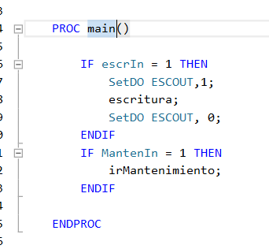

# Laborarorio 2 - Robótica Industrial, entradas y salidas

### Equipo (Grupo de laboratorio Viernes 2-4PM)
- Christian Camilo Cuestas Ibáñez
- José Daniel Suárez Vásquez
- Hector Daniel Vargas Berdejo

## Entradas y salidas 

En esta ocaccion se nos pide  configurar diferentes rutinas condicionadas a diferentes botones, los cuales se consideran salidas y entradas digitales.
Como salida digital Configuraremos un led que indicara si una rutina esta funcionando, como entradas configuraremos dos botones que nos ejecutaran una rutina para llevarlo a una posicion que nos permita manipular la herramienta y otra rutina en la que escriba nuestras iniciales.
Para esto se crean previamente las rutinas llamadas 
-irMantenimiento; 
-escritura;
Cada una de estas sera accionada por una entrada

### Configuracion de entrada y salidas

Para la configuracion de entrada es necesario crear nuevas entradas como  que en nuestro caso se llamaran escrIn (la cual estara asociada a DI_0)  y por otro lado MantenIn (la cual estara asosiada a la entrada DI_1). Esto lo podemos Cofiguarar en la siguiente ventana en roboEstudio.

Ahora se configurara las salidas como ESCOUT para indicar cuando la rutina de escritura se lleva acabo esta salida encendera un led. 

Se podran visualizar todas las entradas y salidas configuradas en un panel de entradas como se ve en la siguiente imagen 

## Implementacion en el codigo

Para finalizar se simulan en incluyen en el main usando if para verificar el estado de las entradas-

Este proceso se simula para verificar que cumpla las ordenes esperadas. El resultado lo podemos ver en el video anexo. 

## Resultado

- [Ver video del resultado](VideoLAB2.mp4)
